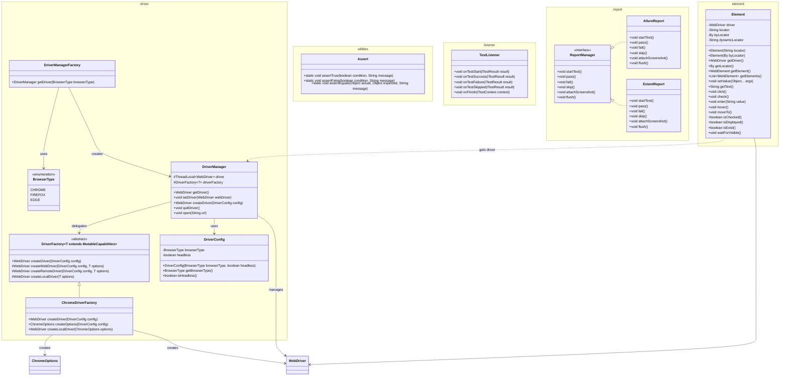

```mermaid
classDiagram

    %% =========================
    %% DRIVER
    %% =========================

    namespace driver {

        class BrowserType {
            <<enumeration>>
            CHROME
            FIREFOX
            EDGE
        }

        class DriverConfig {
            -BrowserType browserType
            -boolean headless

            +DriverConfig(BrowserType browserType, boolean headless)
            +BrowserType getBrowserType()
            +boolean isHeadless()
        }

        class DriverFactory~T extends MutableCapabilities~ {
            <<abstract>>
            +WebDriver createDriver(DriverConfig config)
            #WebDriver createWebDriver(DriverConfig config, T options)
            #WebDriver createRemoteDriver(DriverConfig config, T options)
            #WebDriver createLocalDriver(T options)
        }

        class ChromeDriverFactory {
            +WebDriver createDriver(DriverConfig config)
            +ChromeOptions createOptions(DriverConfig config)
            +WebDriver createLocalDriver(ChromeOptions options)
        }

        class DriverManager {
            #ThreadLocal~WebDriver~ driver
            #DriverFactory~?~ driverFactory

            +WebDriver getDriver()
            +void setDriver(WebDriver webDriver)
            +WebDriver createDriver(DriverConfig config)
            +void quitDriver()
            +void open(String url)
        }

        class DriverManagerFactory {
            +DriverManager getDriver(BrowserType browserType)
        }
    }

    DriverFactory <|-- ChromeDriverFactory

    DriverManager --> DriverFactory : delegates
    DriverManager --> DriverConfig : uses
    DriverManager --> WebDriver : manages

    DriverManagerFactory --> BrowserType : uses
    DriverManagerFactory --> DriverManager : creates

    ChromeDriverFactory --> ChromeOptions : creates
    ChromeDriverFactory --> WebDriver : creates


    %% =========================
    %% ELEMENT
    %% =========================

    namespace element {

        class Element {
            -WebDriver driver
            -String locator
            -By byLocator
            -String dynamicLocator

            +Element(String locator)
            +Element(By byLocator)

            +WebDriver getDriver()
            +By getLocator()
            +WebElement getElement()
            +List~WebElement~ getElements()
            +void setValue(Object... args)

            +String getText()
            +void click()
            +void check()
            +void enter(String value)
            +void hover()
            +void moveTo()

            +boolean isChecked()
            +boolean isDisplayed()
            +boolean isExist()
            +void waitForVisible()
        }
    }

    Element ..> DriverManager : gets driver
    Element --> WebDriver


    %% =========================
    %% UTILITIES
    %% =========================

    namespace utilities {

        class Assert {
            +static void assertTrue(boolean condition, String message)
            +static void assertFalse(boolean condition, String message)
            +static void assertEquals(Object actual, Object expected, String message)
        }
    }


    %% =========================
    %% LISTENER
    %% =========================

    namespace listener {

        class TestListener {
            +void onTestStart(ITestResult result)
            +void onTestSuccess(ITestResult result)
            +void onTestFailure(ITestResult result)
            +void onTestSkipped(ITestResult result)
            +void onFinish(ITestContext context)
        }
    }


    %% =========================
    %% REPORT
    %% =========================

    namespace report {

        class ReportManager {
            <<interface>>

            +void startTest()
            +void pass()
            +void fail()
            +void skip()
            +void attachScreenshot()
            +void flush()
        }

        class AllureReport {
            +void startTest()
            +void pass()
            +void fail()
            +void skip()
            +void attachScreenshot()
            +void flush()
        }

        class ExtentReport {
            +void startTest()
            +void pass()
            +void fail()
            +void skip()
            +void attachScreenshot()
            +void flush()
        }
    }

    ReportManager <|.. AllureReport
    ReportManager <|.. ExtentReport
```