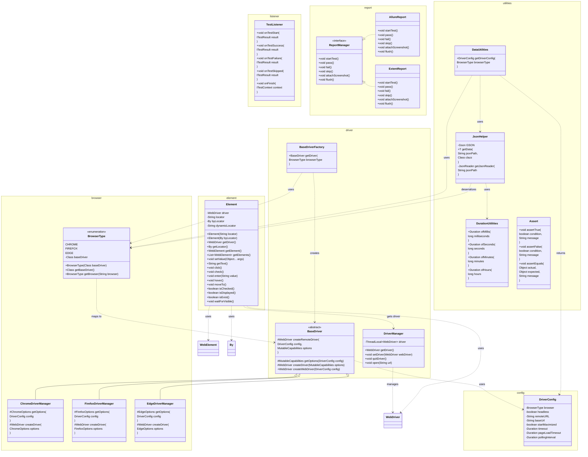

```mermaid
classDiagram

%% =========================================================
%% CONFIG
%% =========================================================

namespace config {

    class DriverConfig {
        -BrowserType browser
        -boolean headless
        -String remoteURL
        -String baseUrl
        -boolean startMaximized
        -Duration timeout
        -Duration pageLoadTimeout
        -Duration pollingInterval
    }
}


%% =========================================================
%% DRIVER
%% =========================================================

namespace driver {

    class BaseDriver {
        <<abstract>>

        #MutableCapabilities getOptions(DriverConfig config)
        #WebDriver createDriver(MutableCapabilities options)

        +WebDriver createWebDriver(DriverConfig config)

        #WebDriver createRemoteDriver(
            DriverConfig config,
            MutableCapabilities options
        )
    }

    class BaseDriverFactory {
        +BaseDriver getDriver(
            BrowserType browserType
        )
    }

    class DriverManager {
        -ThreadLocal~WebDriver~ driver

        +WebDriver getDriver()
        +void setDriver(WebDriver webDriver)
        +void quitDriver()
        +void open(String url)
    }
}


%% =========================================================
%% BROWSER
%% =========================================================

namespace browser {

    class BrowserType {
        <<enumeration>>

        CHROME
        FIREFOX
        EDGE

        -Class baseDriver

        +BrowserType(Class baseDriver)
        +Class getBaseDriver()
        +BrowserType getBrowser(String browser)
    }

    class ChromeDriverManager {
        #ChromeOptions getOptions(
            DriverConfig config
        )

        #WebDriver createDriver(
            ChromeOptions options
        )
    }

    class FirefoxDriverManager {
        #FirefoxOptions getOptions(
            DriverConfig config
        )

        #WebDriver createDriver(
            FirefoxOptions options
        )
    }

    class EdgeDriverManager {
        #EdgeOptions getOptions(
            DriverConfig config
        )

        #WebDriver createDriver(
            EdgeOptions options
        )
    }
}


%% =========================================================
%% ELEMENT
%% =========================================================

namespace element {

    class Element {
        -WebDriver driver
        -String locator
        -By byLocator
        -String dynamicLocator

        +Element(String locator)
        +Element(By byLocator)

        +WebDriver getDriver()
        +By getLocator()

        +WebElement getElement()
        +List~WebElement~ getElements()

        +void setValue(Object... args)

        +String getText()
        +void click()
        +void check()
        +void enter(String value)
        +void hover()
        +void moveTo()

        +boolean isChecked()
        +boolean isDisplayed()
        +boolean isExist()
        +void waitForVisible()
    }
}


%% =========================================================
%% LISTENER
%% =========================================================

namespace listener {

    class TestListener {
        +void onTestStart(
            ITestResult result
        )

        +void onTestSuccess(
            ITestResult result
        )

        +void onTestFailure(
            ITestResult result
        )

        +void onTestSkipped(
            ITestResult result
        )

        +void onFinish(
            ITestContext context
        )
    }
}


%% =========================================================
%% REPORT
%% =========================================================

namespace report {

    class ReportManager {
        <<interface>>

        +void startTest()
        +void pass()
        +void fail()
        +void skip()
        +void attachScreenshot()
        +void flush()
    }

    class AllureReport {
        +void startTest()
        +void pass()
        +void fail()
        +void skip()
        +void attachScreenshot()
        +void flush()
    }

    class ExtentReport {
        +void startTest()
        +void pass()
        +void fail()
        +void skip()
        +void attachScreenshot()
        +void flush()
    }
}


%% =========================================================
%% UTILITIES
%% =========================================================

namespace utilities {

    class DataUtilities {
        +DriverConfig getDriverConfig(
            BrowserType browserType
        )
    }

    class JsonHelper {
        -Gson GSON

        +T getData(
            String jsonPath,
            Class clazz
        )

        -JsonReader getJsonReader(
            String jsonPath
        )
    }

    class DurationUtilities {
        +Duration ofMillis(
            long milliseconds
        )

        +Duration ofSeconds(
            long seconds
        )

        +Duration ofMinutes(
            long minutes
        )

        +Duration ofHours(
            long hours
        )
    }

    class Assert {
        +void assertTrue(
            boolean condition,
            String message
        )

        +void assertFalse(
            boolean condition,
            String message
        )

        +void assertEquals(
            Object actual,
            Object expected,
            String message
        )
    }
}


%% =========================================================
%% DRIVER RELATIONSHIPS
%% =========================================================

BaseDriver <|-- ChromeDriverManager
BaseDriver <|-- FirefoxDriverManager
BaseDriver <|-- EdgeDriverManager

BrowserType ..> BaseDriver : maps to

BaseDriverFactory ..> BrowserType : uses
BaseDriverFactory ..> BaseDriver : creates

BaseDriver ..> DriverConfig : uses

DriverManager ..> WebDriver : manages


%% =========================================================
%% ELEMENT RELATIONSHIPS
%% =========================================================

Element ..> DriverManager : gets driver
Element ..> WebDriver : uses
Element ..> WebElement : uses
Element ..> By : uses


%% =========================================================
%% LISTENER / REPORT
%% =========================================================

ReportManager <|.. AllureReport
ReportManager <|.. ExtentReport


%% =========================================================
%% UTILITIES
%% =========================================================

DataUtilities ..> BrowserType : uses
DataUtilities ..> DriverConfig : returns
DataUtilities ..> JsonHelper : uses

JsonHelper ..> BrowserType : deserializes
JsonHelper ..> DurationUtilities : uses
```